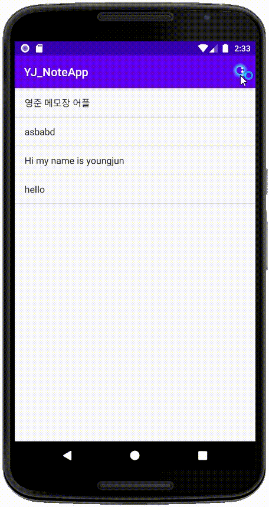
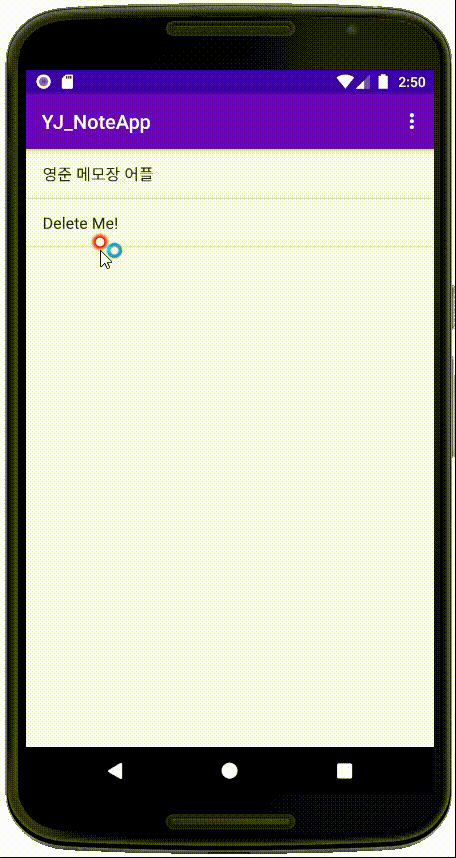
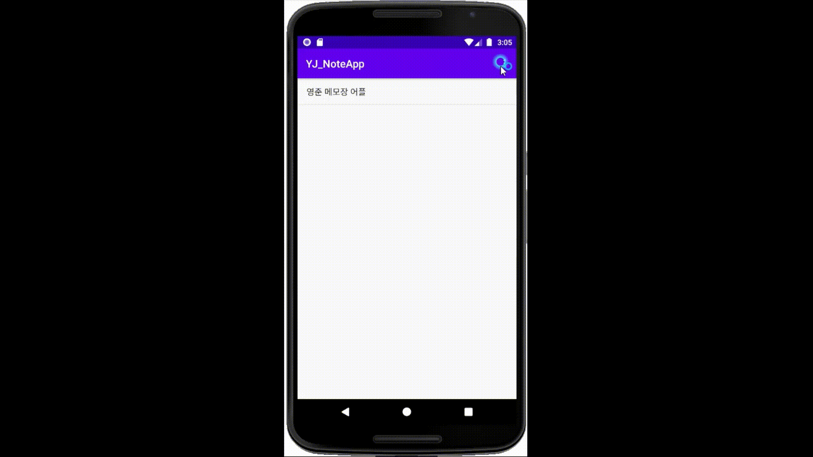

# Android Note App

  

## 📕 안드로이드 메모장 App

메모를 생성하고 삭제할 수 있으며 App을 재시작해도 메모가 남아있는 간단한 프로그램

---

### 1️⃣ 메모 생성하기

- 우측 상단 버튼을 클릭
- Add note 클릭
- 메모 입력
- 뒤로가기

---

### 2️⃣ 메모 삭제하기

- 삭제할 메모 길게 클릭
- 삭제할래요? → 네!

### 3️⃣ Demo 영상

- 메모 생성하기
- App 재실행으로 저장된 메모 확인하기
- 메모 삭제하기

